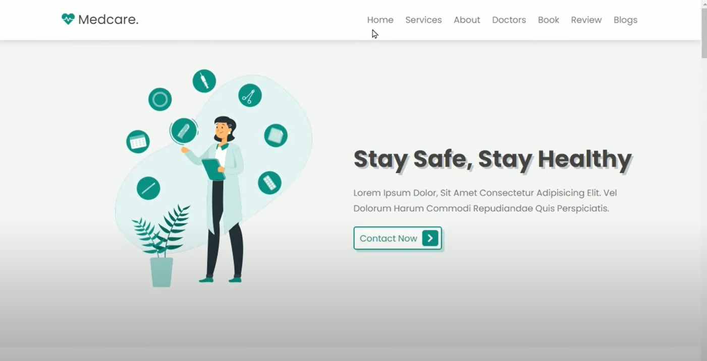
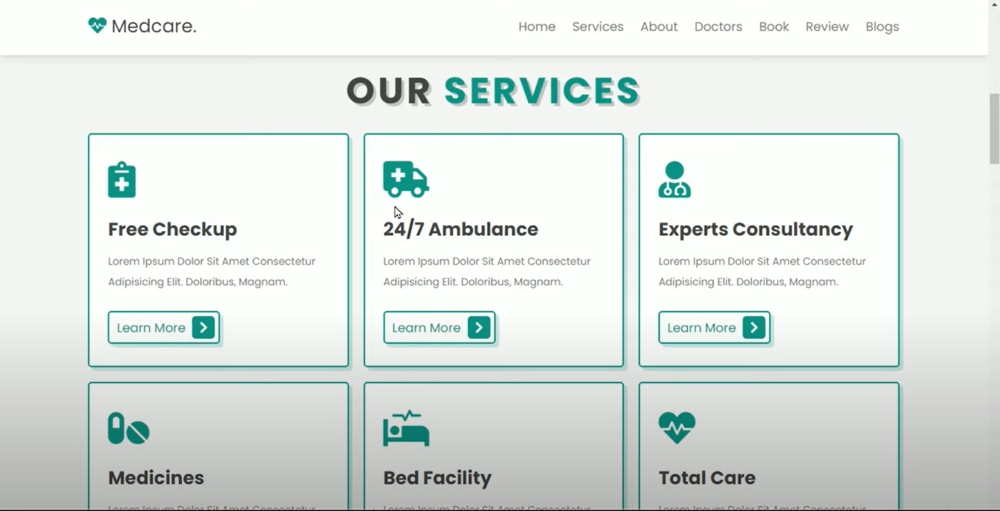
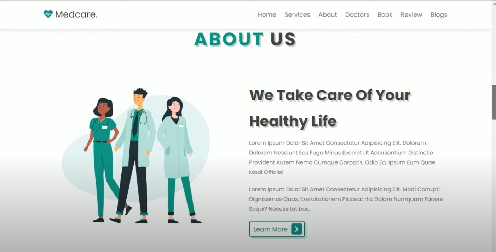
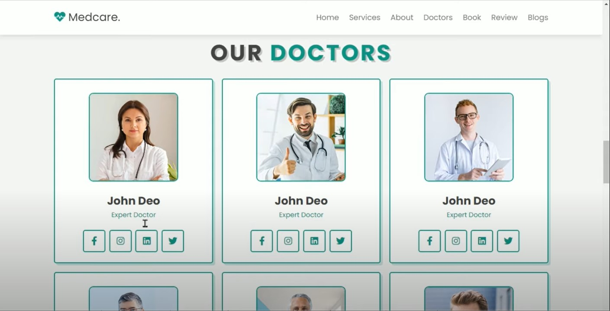
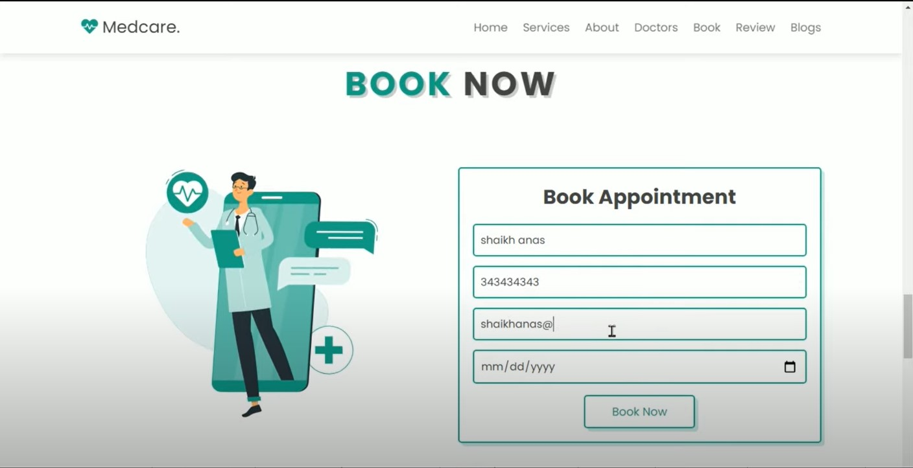
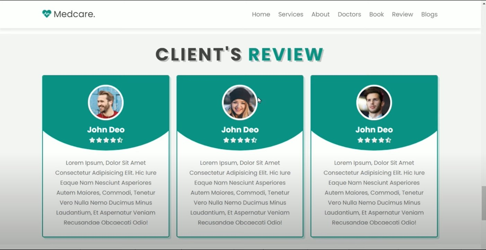
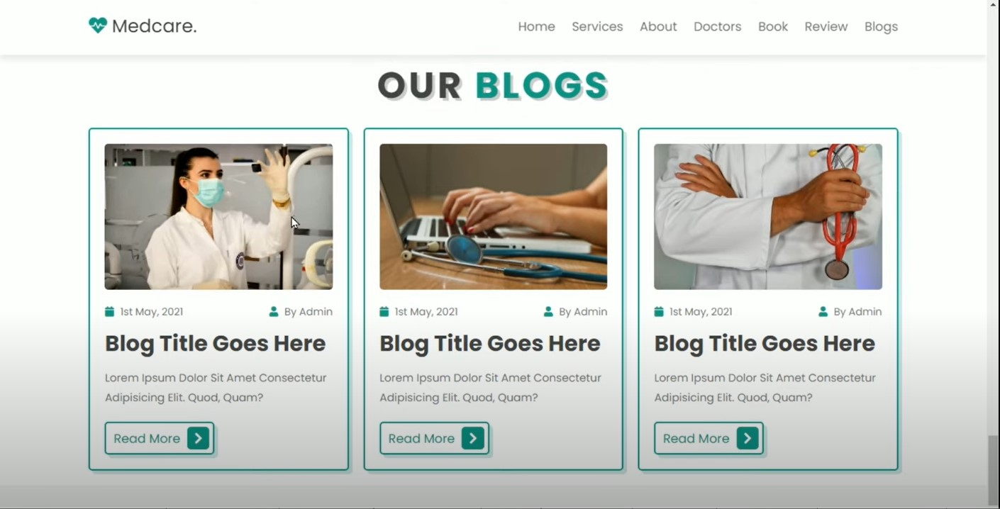
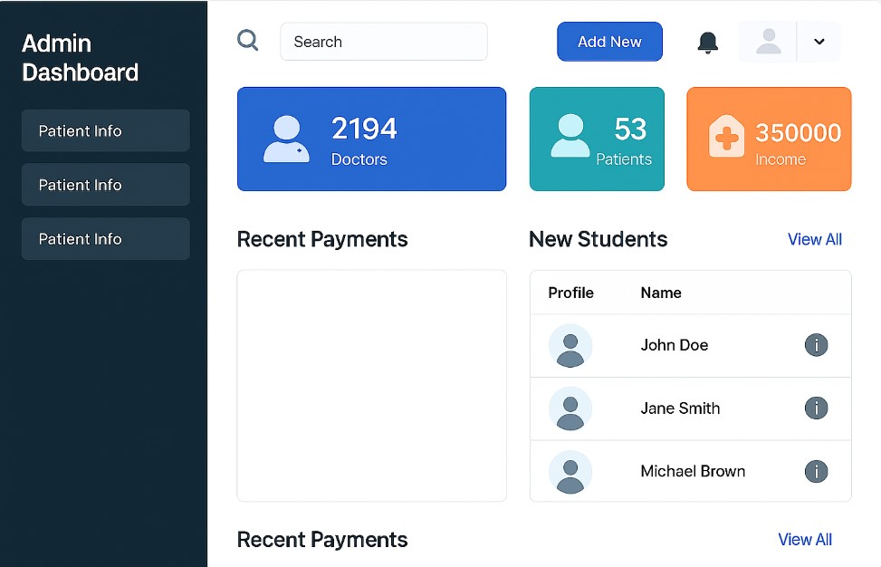

# Online Doctor Appointment System

# Web Development with ASP.NET

This project is a comprehensive ASP.NET web application built as part of a system development project. It demonstrates the use of **C#**, **ASP.NET Web Forms**, **SQL Server**, and **HTML/CSS/JavaScript** to build a role-based platform for managing different user types and features like admin control, form submission, and database interaction.

---

    

    

    

    

    

    

    

    

## 🚀 Features

- 🔐 **Role-Based Login System**
  - Admin
  - Doctor
  - Patient

- 📋 **Form Submission & Data Handling**
  - Registration Forms
  - Appointment Booking
  - Patient Details Entry

- 🖥️ **Admin Dashboard**
  - Manage Users (Doctors/Patients)
  - View & Delete Entries
  - Manage Appointment
    

- 📄 **Frontend Design**
  - HTML, CSS, JavaScript
  - Responsive and Clean UI

---

## 🛠️ Technologies Used

- ASP.NET Web Forms
- C# (Code-Behind)
- SQL Server (Backend)
- HTML/CSS
- JavaScript
